# Data Sensor Airflow

An end-to-end local data engineering project that simulates industrial
machine sensors, ingests events through MQTT, buffers readings in SQLite,
orchestrates incremental processing with Apache Airflow, stores raw and
aggregated data in PostgreSQL, and displays operational metrics in a Dash
dashboard.

## Architecture

```mermaid
flowchart LR
    P["Machine publishers<br/>reading every 2 seconds"]
    M["Eclipse Mosquitto<br/>MQTT broker"]
    S["Subscriber<br/>continuous ingestion"]
    SQ["SQLite<br/>local buffer"]
    D1["Airflow DAG<br/>every 1 minute"]
    RAW["PostgreSQL<br/>SensorData"]
    D2["Airflow DAG<br/>2-minute windows"]
    MET["PostgreSQL<br/>SensorMetrics"]
    DASH["Dash dashboard<br/>individual and fleet views"]

    P --> M --> S --> SQ --> D1 --> RAW --> D2 --> MET --> DASH
```



The pipeline separates event time from load time:

- `dtInsert` records when the sensor reading was generated;
- `dtLoad` records when the reading reached PostgreSQL;
- `dtProcessing` records when the metric window was calculated.

This makes it possible to inspect ingestion latency and processing delays.

## Main features

- multiple simulated machines publishing concurrently;
- sensor readings generated every two seconds;
- MQTT communication through Eclipse Mosquitto;
- continuous subscriber with local SQLite buffering;
- incremental SQLite-to-PostgreSQL ingestion every minute;
- idempotent PostgreSQL writes;
- two-minute metric windows with a late-arrival watermark;
- current, voltage, and temperature aggregates;
- individual machine and `All machines` dashboard views;
- average line with a shaded minimum-to-maximum range;
- temperature threshold and visual alarm;
- responsive dashboard with automatic refresh.

## Sensor simulation

Each publisher simulates:

- voltage around `220 V` with periodic variation and sensor noise;
- current around `10 A` with periodic load variation and sensor noise;
- temperature with thermal inertia tied to the current load.

The simulation uses monotonic elapsed time so the two-second sampling interval
does not repeatedly capture the same phase of the generated signals.

## Data pipeline

### 1. MQTT ingestion

The publisher sends one JSON event every two seconds. The subscriber consumes
messages continuously and stores them in the SQLite `SensorData` table.

SQLite acts as a simple local buffer between event ingestion and batch
processing.

### 2. Raw data loading

The `sqlite_to_postgres` DAG runs every minute and incrementally copies new
SQLite records into the PostgreSQL `SensorData` table.

The SQLite `AUTOINCREMENT` value becomes `nSourceId` in PostgreSQL. Since all
machines share one SQLite table, this value is a global ingestion cursor.

### 3. Metrics processing

The `sensor_processing` DAG calculates closed two-minute windows. It runs on
odd minutes so the preceding ingestion has time to finish.

For each machine and window, it calculates:

- record count;
- average, minimum, and maximum current;
- average, minimum, and maximum voltage;
- average, minimum, and maximum temperature;
- temperature alert status.

A 15-second watermark prevents a window from being processed immediately at
its boundary. Late records can trigger an idempotent recalculation of the
affected window.

### 4. Dashboard

The dashboard supports two visualization modes.

#### Individual machine

- average line for each metric;
- shaded minimum-to-maximum range;
- latest average current, voltage, and temperature;
- temperature threshold line;
- pulsating red alarm when the latest window is above the threshold.

#### All machines

- one average line per machine;
- machine names in the chart legend;
- `🚨` marker beside machines with a current temperature alert;
- fleet totals for monitored machines, processed records, and active alerts;
- pulsating summary card when at least one machine is in alert.

The default temperature threshold is configured in `config/config.json`:

```json
{
  "metrics": {
    "temperature_alert_threshold": 85
  }
}
```

The metric window is marked as an alert when its maximum temperature reaches
or exceeds this threshold.

## Technologies

- Python 3.10
- Apache Airflow 3.3
- PostgreSQL 16
- SQLite
- Eclipse Mosquitto 2
- MQTT
- Dash and Plotly
- Pandas
- Docker Compose

## Project structure

```text
DataSensorAirflow/
├── config/                  # Non-secret application settings
├── controllers/             # MQTT, SQLite, and PostgreSQL controllers
├── dags/
│   ├── sqliteToPostgres.py  # Incremental raw-data ingestion
│   └── sensorProcessing.py  # Two-minute metric processing
├── dashboard/
│   ├── assets/
│   │   └── dashboard.css    # Visual alarm animation
│   └── DashInterface.py
├── database/                # Runtime SQLite files, ignored by Git
├── docker/
│   ├── mosquitto/
│   ├── postgres/
│   └── sqlite/
├── models/
├── scripts/
│   ├── PublisherMqtt.py
│   ├── SubscriberMqtt.py
│   └── initSqlite.py
├── .env.example
├── docker-compose.yml
├── Dockerfile.airflow
├── Dockerfile.app
├── requirements-airflow.txt
└── requirements-app.txt
```

## Requirements

- Docker with the Compose plugin;
- Python 3.10 to run publishers on the host.

## Configuration

Create the local environment file:

```bash
cp .env.example .env
```

On Linux, set `AIRFLOW_UID` to your host user ID so bind-mounted files have
the correct ownership:

```bash
sed -i "s/^AIRFLOW_UID=.*/AIRFLOW_UID=$(id -u)/" .env
```

Replace the placeholder passwords and `AIRFLOW_JWT_SECRET` in `.env`. This
file is ignored by Git. The committed `config/config.json` contains only
non-secret application defaults.

MQTT configuration uses the following precedence:

1. `MQTT_HOST`, `MQTT_PORT`, and `MQTT_TOPIC` environment variables;
2. values under `mqtt` in `config/config.json`.

The publisher runs on the host and uses `localhost` by default. Docker Compose
sets `MQTT_HOST=mosquitto` for the subscriber inside the Docker network.

## Running the project

Build and start the complete stack:

```bash
docker compose up -d --build
```

The one-shot `airflow-init` and `sqlite-init` services should finish with exit
code `0`. Check all services with:

```bash
docker compose ps -a
```

Follow the logs with:

```bash
docker compose logs -f
```

No separate Airflow initialization command is required. Airflow services wait
for `airflow-init` to complete successfully.

## Running publishers

Create a Python environment on the host:

```bash
python3 -m venv .venv
source .venv/bin/activate
pip install -r requirements-app.txt
```

Run one publisher:

```bash
python scripts/PublisherMqtt.py --machine Machine1
```

To compare multiple machines, run each command in a separate terminal:

```bash
python scripts/PublisherMqtt.py --machine Machine1
python scripts/PublisherMqtt.py --machine Machine2
python scripts/PublisherMqtt.py --machine Machine3
```

To use a different broker:

```bash
MQTT_HOST=192.0.2.10 MQTT_PORT=1883 \
python scripts/PublisherMqtt.py --machine Machine1
```

Stop a publisher with `Ctrl+C`.

## Access

- Airflow: <http://127.0.0.1:8080>
- Dashboard: <http://127.0.0.1:8050>
- PostgreSQL: `127.0.0.1:5433` by default
- Mosquitto: `127.0.0.1:1883` by default

The Airflow username comes from `AIRFLOW_USERNAME`. With Simple Auth Manager,
the generated password is stored locally in
`config/simple_auth_manager_passwords.json.generated`. This file is ignored
by Git.

Inside the Docker network, PostgreSQL is available as `postgres:5432` and
Mosquitto as `mosquitto:1883`. Host ports may be changed in `.env`. Published
ports bind to `127.0.0.1` and are not exposed on the LAN by default.

## Resetting local data

Stop the stack while preserving local data:

```bash
docker compose down
```

To intentionally delete the PostgreSQL and Mosquitto volumes:

```bash
docker compose down --volumes
```

The SQLite database is a bind-mounted file under `database/` and is not
removed by `docker compose down --volumes`.

